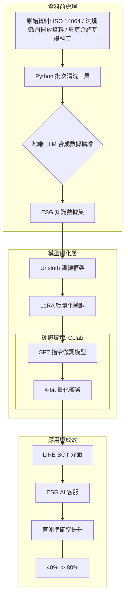

# 集團碳足跡平台AI小助手

> 基於 unsloth/Qwen3-14B-Base-unsloth-bnb-4bit SFT 

## 系統架構圖 

```mermaid
graph TD
    subgraph Data_Engineering [資料前處理]
        A[原始資料: ISO 14064 / 法規 /政府開放資料 / 網頁介紹基礎科普] --> B[Python 批次清洗工具]
        B --> C{地端 LLM 合成數據擴增}
        C --> D[ESG 知識數據集]
    end

    subgraph Model_Optimization [模型優化層]
        D --> E[Unsloth 訓練框架]
        E --> F[LoRA 輕量化微調]
        F --> G[SFT 指令微調模型]
        
        subgraph Hardware_Constraint [硬體環境: Colab]
            G --> H[4-bit 量化部署]
        end
    end

    subgraph Application_Layer [應用與成效]
        H --> I[LINE BOT 介面]
        I --> J[ESG AI 客服]
        
        K[盲測準確率提升] --- L[40% -> 80%]
        J --> K
    end
```
